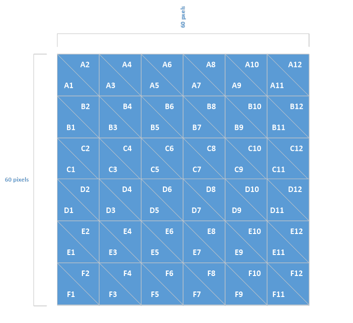

# TriangleExercise

This project was generated with [Angular CLI](https://github.com/angular/angular-cli) version 1.7.4.

## Cherwell Triangle Exercise 

Solution by me. Infrastructure is in place to swap out JSON file for API. See trianglesApi on my GitHub (need mLab account)

## Triangle Grid

### Requirements

* Find coordinates of a triangle with row/column
* Find row/column location with coordinates provided